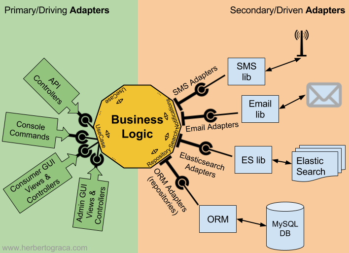

# Arquitetura Limpa na Prática
Repositório do código do livro Arquitetura Limpa do @otaviolemos

## Estrutura da aplicação

- Entidades

    As entidades e os Value Objects estão presentes no pacote `./entities`, juntamente com as exceptions que os mesmos utilizam.

    Todas as classes de domínio possuem um método `create`, que é um Factory Method

- Caso de Uso

    Os casos de uso estão presentes no pacote `./use-cases`, as interfaces estão em subpacotes chamados `ports`, essas interfaces estão localizadas dentro dos casos de uso que a utilizam, por exemplo: a interface `TokenManager` é utilizada no caso de uso de autenticação, então essa interface está localizada dentro do caso de uso de autenticacao `./use-cases/authentication/ports`, pois é lá que ela é utilizada

    E se a interface for utilizada em mais de um caso de uso, esta ficará localizada em `./use-cases/ports`

    Um detalhe importante: Todos os casos de uso implementam uma interface chamada `UseCase`

- Adaptadores de Interface

    Pode-se dizer que a Arquitetura Limpa é uma implementação do pattern Ports & Adapters (também chamada de Arquitetura Hexagonal)

    Como podemos ver na imagem, Ports & Adapters tem 2 tipos de "adapters", os **Primary Adapters**, que são os dispositivos/softwares etc, que irão consumir o **core do sistema**, e tem os **Secondary Adapters**, que são os sistemas externos que o **core do sistema** irá se comunicar.

    

    Os Secondary Adapters estão localizados em `./use-cases/ports` e `./use-cases/*/ports`, são as interfaces que utilizamos como **Inversão de Dependencia**, e que servem de abstração para as implementações concretas.

    os Primary Adapters estão localizados no pacote `./presentation`, nesse pacote temos a classe `WebController`, e temos uma interface `ControllerOperation`, todas as operações no sistema devem ter sua própria classe e implementar essa interface.

    A classe `WebController` tem `ControllerOperation` como dependência, e as implementações da interface `ControllerOperation` tem `UseCase` como dependência, por exemplo:

    Vamos pensar no caso de uso **SignUp**, a classe `WebController` será acionada, essa classe tem `ControllerOperation` como dependência, a implementação de `ControllerOperation` é `SignUpOperation`.

    `SignUpOperation` tem `UseCase` como dependência, a implementação de `UseCase` é `SignUp`, então em tempo de compilação isso irá acontecer:

      WebController -> SignUpOperation -> SignUp

    Por isso precisamos de uma interface `UseCase` para cada caso de uso, o `ControllerOperation` sempre vai chamar o caso de uso correspondente.

    O objetivo disso é deixar toda essa parte do Primary Adapters agnóstica a tecnologia, repare que essa camada não depende de nenhum framework de servidor web que expõe rotas etc

- Frameworks & Drivers

    Nessa camada temos as implementações das interfaces que os casos de uso utilizam, as implementações estão localizadas no pacote `./external`, são classes de implementação do MongoDB, bcrypt e jsonwebtoken

- Principal & Configuração

    Essa camada é onde temos configurações de rotas de api utilizando Express, isso está localizado em `./main/config/setup-routes.ts` (este por sua vez irá chamar a classe `WebController`)
    
    Há também configuração de middleware para autenticação/validação de token, configuração de CORS etc, e temos também a configuração da injeção de dependência, que é  feita manualmente com Factory Methods, isso está localizado em `./main/factories`

    Os diretórios `./main/config/setup-routes.ts` e `./main/factories` são fundamentais para entender como a chamada no endpoint chega até o caso de uso.

## Algumas arquiteturas que inspiraram a AL

### Data, Context e Interation (DCI)

- Data é o acesso ao banco, chamadas externas etc
- Interation é a regra de negócio, pois ela interagir com os casos de uso
- Context é por exemplo, contexto de inventário, contexto de pedido, contexto de produto

Esse context é bem parecido com o Bounded Context do DDD, dentro do contexto vão ter os casos de uso, a interação com esses caso de uso formam a regra de negocio, e cada caso de uso vai consumir sua fonte de dados.

### Boundary, Control e Entity (BCE)

Essa arquitetura é adequada para sistemas que lidam com diversas entradas externas, que seria o Boundary.

Teremos um control, que é uma implementação do pattern Façade, pois ele vai unificar essas entradas, e irá interagir com as entidades, são os modelos e as regras de negocio.